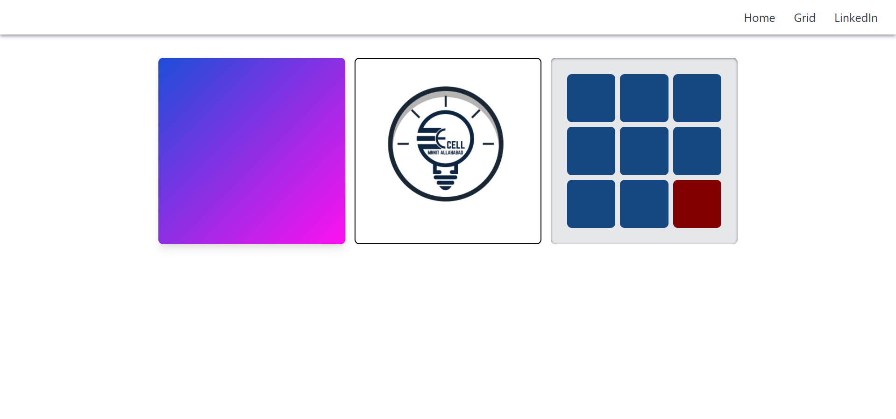
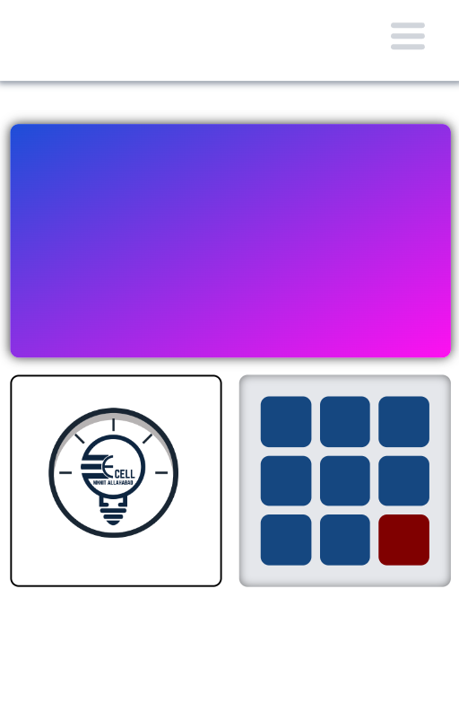
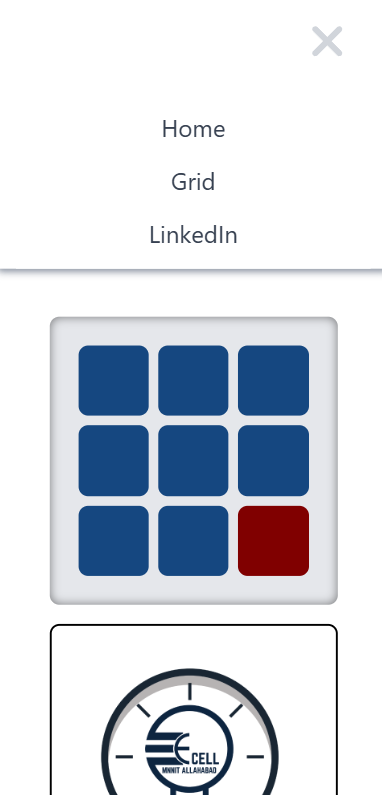

# *Squid Game Themed Profile*

A Grid built with *React* and a fun Squid Game-inspired profile page 

## *Deployed Url*

Link:- https://e-cell-task-five.vercel.app/

## *Screenshots*







## *Technologies Used*

- React
- Tailwind CSS


## Technologies Used
* React
* React Router
* Tailwind CSS
* CSS Grid
* Responsive Design

## Setup Instructions
1. Clone the repository
```bash
git clone <repository-url>
```

2. Install dependencies
```bash
cd frontend
npm install
```

3. Run the development server
```bash
npm run dev
```

## Project Structure
```
frontend/
├── src/
│   ├── assets/
│   ├── components/
│   │   └── Navbar.jsx
│   ├── pages/
│   │   ├── Home.jsx
│   │   └── Grid.jsx
│   └── App.js
```

### Interactive Grid
* 3x3 grid with dynamic cell colors
* Click-based memory game mechanics
* Built-in reset functionality

### Profile Section
* Dynamic personal information display
* Social media integration
* Animated background design
* Interactive hover effects

### Navigation
* Responsive navbar component
* Smooth page transition animations

## Developer Information
* **Name**: Harsh Sharma
* **Registration Number**: 20233137
* **LinkedIn Profile**: https://www.linkedin.com/in/harsh-sharma-310134298/
